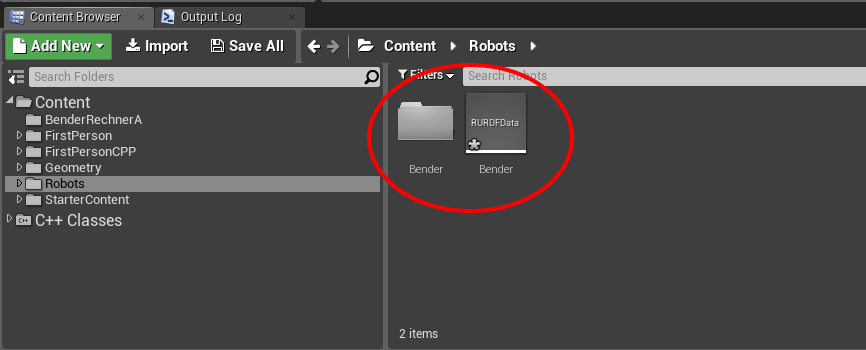

# __Roboter models from URDF based XML files__

## Creators

Andreas Schönfeld, Patrick Kellmann

This project aimed to create robots in Unreal Engine 4 using URDF. The links
should be constrained to each other by joints of various types and form a
hierarchy. Furthermore the links should properly react to physics and
collisions. Dependently on the joint type rotaion and translation of the links
to certain positions, which can be limited by limits specified in the URDF.  

The project is supposed to be as easy to use as possible so that ideally the
user can import a URDF based XML file and then use this robot description to
drag the described robot into the world.

## Necessary software
- Unreal Enginen 4 (4.15)
- Text editor for xml URDF creation/modification

## Usage

The following files have to be located in the source folder:
- RFactoryRRobot.h/.cpp
- RFactoryRURDFData.h/.cpp
- RRobot.h/.cpp
- RURDFData.h/.cpp
- RURDFParser.h/.cpp

It is usually necessary to rebuild the project and/or generate the Visual Studio
project files before launching the editor.  

In the UE4 editor the URDF based XML file can then be imported either by
dragging and dropping it into the content browser (the editor might take a
second to recognise the file as importable) or importing it via the import
button. The robot description files can also be reimported the same way and will
be overwritten. If any custom meshes are used for the imported robot these
meshes have to be located next to the imported XML file or in a subfolder next
to the XML file and can be referenced by a relative path within the xml (e.g. 
`<mesh filename="/Meshes/MyMesh.fbx"/>`). If that is not the case the full path
to the mesh has to be used. A window will popup in order to specify some import
options for the meshes. This window should simply be closed with the button
`Import All`.  
  

A URDFData asset and a folder of the same name are now visible in the
content browser at the import location. The folder is not generated if no custom
meshes are used for the robot.  
  
This folder contains the imported meshes and neither the folder nor the meshes
in it should be renamed or deleted. Otherwise the robot can not be built.  
If any mesh can not be imported a messagebox will appear with the path and names
of the meshes that could not be imported. These paths/filenames should then be
fixed in the XML file, which can then be reimported to import the missing
meshes.  
The URDFData asset can now be dragged into the editor world where the robot is
created immediately.  
  

To activate the motors of a robot the functions `RotateJoint` for revolute and
`MovePrismaticJoint` for prismatic joints have to be called. Both functions
need the name of the joint, which child link is the link to be moved/rotated
and the targeted position. If the targeted position exceeds the specified limit
the joint will continually drive against that limit.

## URDF standards

The XML file must adhere to URDF standards unless stated otherwise as they are
stated here:
- [link specified model](http://wiki.ros.org/urdf/XML/model)
- [link specified joint](http://wiki.ros.org/urdf/XML/joint)
- [link specified link](http://wiki.ros.org/urdf/XML/link)

## Known issues

The following points should be regarded to ensure that the robot is created
and works correctly:
- Only definitions of Links and Joints of a robot are supported. Additional content in the XML may cause unexpected behaviour.  
- Material and texture elements are not supported and will be ignored.  
- Every link and joint must have a unique name.  
- Double definitions of elements and attributes within a link/joint are not supported and may cause unexpected behaviour.  
- Global definitions for reusing purposes are not supported and may cause unexpected behaviour.  
- If no mass is specified for a link UE4 will automatically calculate the mass for the link, which might not result in the expected behaviour.  
- Too low mass for a link (below 2kg) might cause unexpected behaviour during runtime especially when the weight difference between the constrained links is too big (>90% of the heavier link).

