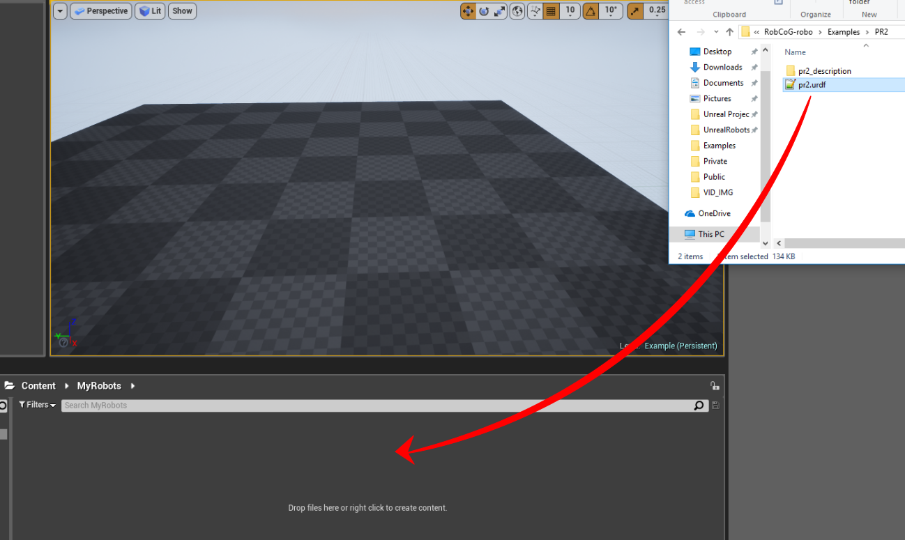

# URoboSim

Unreal engine based robot simulator.

# Features

* Import a URDF file into UE4 by drag & drop into the content browser. A new asset is created with the URDF information. Before dragging the asset into the game world, certain properties can be edited using a new visual interface found in the Editor Mode window.

* As an optional feature, this project can be run with the [UROSBridge](https://github.com/robcog-iai/UROSBridge) plugin to control the imported robot from a ROS server through websockets.

* The URDF can be placed inside a folder called XML which should be in the same directory as the Unreal Engine Project File.

* Note that if the URDF uses meshes, it likely keeps them in one or more folders.

* Make sure that for each robot within the XML folder, the file system reflects the structure that the URDF expects.

* For example, for the pr2, it expects to find the wheel mesh here: "pr2_description/meshes/base_v0/wheel.dae". So in the same directory as the pr2.urdf, there should be a folder called pr2_description which contains the subsequent folders and file.

* Be sure to check the [Wiki](https://github.com/robcog-iai/URoboSim/wiki) page for more details.

* See [here](https://github.com/gnoliyil/pr2_kinetic_packages/tree/e43479ea6088062b63271c6b94417c266429d439) PR2 Packages for ROS Kinetic Kame.

* See the [ex-ros-tf-robosim](https://github.com/robcog-iai/RobCoG/tree/ex-ros-tf-robosim) branch of RobCoG as an Unreal Project example with PR2 [UROSBridge](https://github.com/robcog-iai/UROSBridge) communication and TF publishing with [UTFPublisher](https://github.com/robcog-iai/UTFPublisher).

# Quick Start

Drag and drop a compatible urdf in the content menu

Drag and drop the the generated file in the world

Generated robot tree

## Credits

* Unreal Robots Bachelor Project students
* GSoC 2017 students

### Engine Version 4.18
